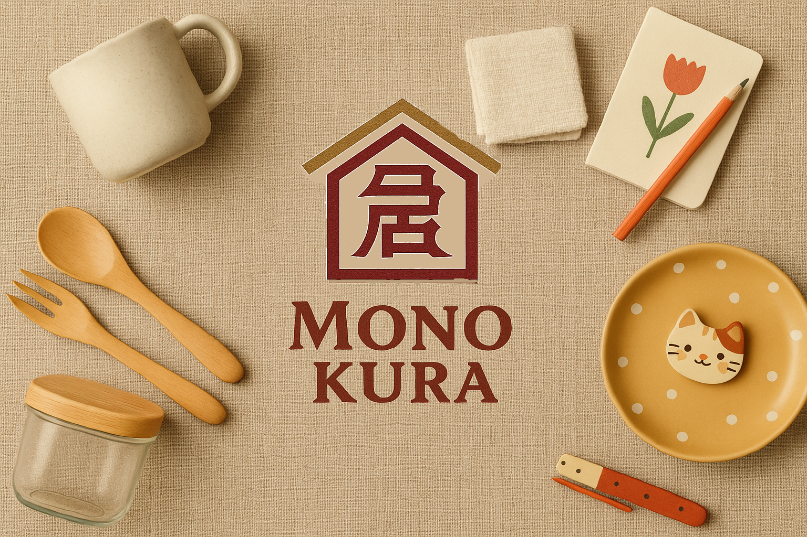

<!DOCTYPE html>
<html lang="ja">
<head>
  <meta charset="UTF-8" />
  <meta name="viewport" content="width=device-width, initial-scale=1.0" />
  <title>Mono Kura</title>
  <link rel="stylesheet" href="style.css" />
</head>
<body>
  <header>
    
  </header>

  <main>
    <section class="hero">
      
      <h1>暮らしに遊び心を</h1>
    </section>

    <section class="intro">
      

        Mono Kuraは、あなたの趣味とちょっとした遊び心をテーマにした日用雑貨のお店です。 
        伝統と現代のライフスタイルをつなぐ、そんな商品を取り揃えています。
      

    </section>

    <section class="products">
      <h2>商品サンプル</h2>
      

        
        
        
      

    </section>

    <section class="shop-link">
      <a href="https://monokuralife.base.shop/" class="shop-button" target="_blank">BASEショップへ</a>
    </section>
  </main>

  <footer>
    
&copy; 2025 Mono Kura

  </footer>
</body>
</html>
